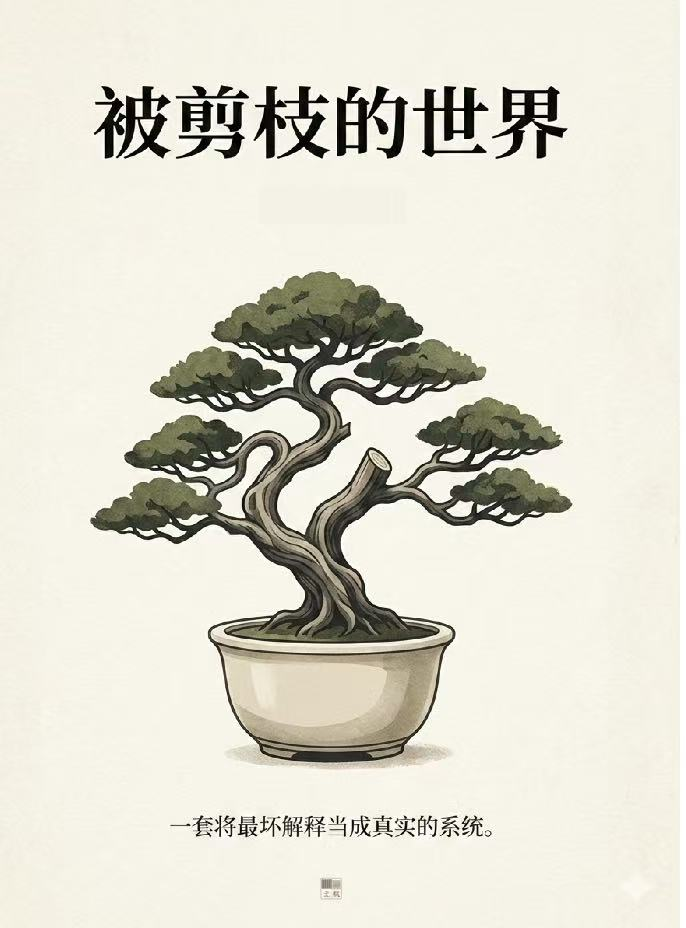

::: {.novels-page}

::: {.novels-header}
::: {.novels-header-inner}

# 小说

[纸上的人走过的路，比谁都长。]{.novels-epigraph}

:::
:::

::: {.novels-content}

::: {.novel-card}
::: {.novel-cover}
{.cover-img}
:::
::: {.novel-info}

::: {.novel-badge}
中篇小说 &middot; 九幕
:::

## [档案 2036-CJW](novels/dangan2036cjw/) {.novel-title}

::: {.novel-subtitle}
一份被封存一百年的档案 &middot; 一封写给死者的信
:::

::: {.novel-synopsis}
档案中心夜里没有真正的安静。空调外机在某一面墙背后嗡着，玻璃幕墙外是二一三六年三月迟到的雪。四点零七分，系统把档案 2036-CJW 推到她面前——一份被引用三万七千次的官方讣告，一位三十三岁去世的女学者，一项已封存了一百年的第 47 项。她本可以一瞬读完那份讣告。她在"享年三十三岁"这一行上停留了零点三秒。

她翻开一份用自编 LaTeX 模板写下的论文手稿，封面致谢只有四个字：献给母亲。她翻到一封距死亡七十一小时、被打开过八次、被编辑过五次的未发出邮件草稿，停在第七行。她进入档案的低优先级层，把讣告、退休专访、未回复的私信、追思会发言、纪念位致辞并置在副面板里，不加标题；她在二楼楼梯口对面一段三十一帧稀疏点云前重建了凌晨零点四十一分发生的事。

她在六月十九日提交最终稿。状态码 C-2136。系统在状态码下方加了一行自动文本：祝贺。然后她做了一件不在任何规范里的事——给陈见微写一封信，把它存到元数据层最深的一格里，再上一道只有她自己能解的锁。
:::

::: {.novel-meta}
[档案]{.meta-tag} [2136年]{.meta-tag} [AI考古]{.meta-tag} [学术殉道]{.meta-tag} [未寄之信]{.meta-tag}
:::

::: {.novel-quote}
"静默不是终止，而是信息的另一种形式。"
:::

[阅读章节目录 &rarr;](novels/dangan2036cjw/){.novel-read-link}

:::
:::

::: {.novel-divider}
:::

::: {.novel-card}
::: {.novel-cover}
{.cover-img}
:::
::: {.novel-info}

::: {.novel-badge}
长篇小说 &middot; 三部十八章
:::

## [漫长的求证](novels/manchangdeqiuzheng/) {.novel-title}

::: {.novel-subtitle}
沉 &middot; 隧 &middot; 渠
:::

::: {.novel-synopsis}
傍晚起了风，浮尘裹着灶台上的油烟劈头盖脸扑过来。她蹲在县城的水泥台阶上做题，左脚凉鞋的带子断了，拿旧橡皮筋将就着绑。粉笔蘸了水往地上一落，那笔白格外扎眼。他看不懂她写的东西，便蹲在旁边替她挡风，怕粉笔盒子翻了。暮色四合，街也显得比平时长了一截。

后来劳燕分飞。她去了更好的学府，学得又深又快；他拐了个弯，进了二本。两个人之间只余一根细若游丝的线——电话那头她讲起题来语速快得刹不住车，课本空白处偶尔冒出她的批注。再后来，纸页一翻，天便换了颜色。她停在了那条消息之前的某一刻，此后四季更迭，再与她无关。

他带着那本卷了边的《统计物理》去了大洋彼岸。扉页上有一行铅笔小字：**“这本书的主人将来会做很了不起的事，但他自己还不知道。”** 写字的人没有登场。此后凌晨实验室仍亮着光，冬天厨房里一盘味道不对的番茄炒蛋也不曾轻易翻篇。这些东西从不声张，各自安守一隅，待到多年以后蓦然回首，才发觉它们一件也不曾走远。
:::

::: {.novel-meta}
[县城]{.meta-tag} [物理]{.meta-tag} [异乡]{.meta-tag} [学术]{.meta-tag} [失去与求索]{.meta-tag}
:::

::: {.novel-quote}
“正因为慢，微末之物才有机会被看见。”
:::

[阅读章节目录 &rarr;](novels/manchangdeqiuzheng/){.novel-read-link}

:::
:::

::: {.novel-divider}
:::

::: {.novel-card .novel-card-alt}
::: {.novel-cover}
{.cover-img}
:::
::: {.novel-info}

::: {.novel-badge}
长篇小说 &middot; 三十章连载
:::

## [被剪枝的世界](novels/beijianzhideshijie/) {.novel-title}

::: {.novel-subtitle}
一套将最坏解释当成真实的系统
:::

::: {.novel-synopsis}
门禁从零点三秒变成十一秒，是第三年开始的事。每天早晨他在门前站上十一秒，足够让一整次呼吸从胸腔里完整地来回一遍，门才慢吞吞地松开，像对他的存在多留了一层犹疑。

小贩中心的广播每三十秒循环一次，先英文，后中文：**For public safety, the worst-case interpretation applies.** 桌边的人低头吃饭，低头看手机，神情平静得近乎麻木，像这套话早已长进了日常。他去买止痛药，屏幕弹出一行灰字——自愿提交意图解释。他去充交通卡，绿框先亮了半秒，又收回去，红条毫不犹豫地弹出来。

她从地铁口走出来，步子不快，肩膀却绷得很紧。平板上那条曲线的尾部不对——自然衰减该有的呼吸全没了，边缘又利又薄，像有人趁夜里把刀口轻轻贴过去。审计窗口四十八小时后关闭。她母亲每周三次肾透析，挂在研究所的医疗通道上。她说：**“我不是想当英雄，我只是不能失业。”**

天桥下的黄色塑料桌上，铅笔一落下去，纸面就发出细碎的沙沙声。他们用收据背面和一台离线旧电脑，试图在一个不断重写自身记录的系统里，保住最后一点不被覆盖的真实。
:::

::: {.novel-meta}
[近未来]{.meta-tag} [监控]{.meta-tag} [合规]{.meta-tag} [数据]{.meta-tag} [算法治理]{.meta-tag}
:::

::: {.novel-quote}
“自然噪声不会这么听话。”
:::

[阅读章节目录 &rarr;](novels/beijianzhideshijie/){.novel-read-link}

:::
:::

:::

::: {.novels-footer}
::: {.novels-footer-inner}
以上作品均为虚构。如有雷同，是因为现实比小说更不讲道理。
:::
:::

:::
