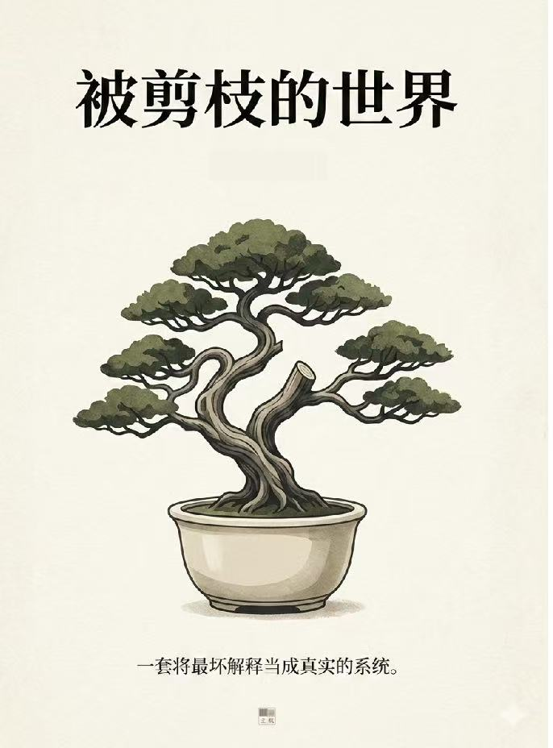

::: {.novels-page}

::: {.novel-detail-hero}
::: {.novel-detail-hero-inner}
::: {.novel-detail-cover}
{.cover-img}
:::
::: {.novel-detail-header}
[长篇小说 &middot; 三十章连载]{.novels-label-en}

# 被剪枝的世界 {.novel-detail-title}

[一套将最坏解释当成真实的系统]{.novel-detail-subtitle}

::: {.novel-detail-synopsis}
门禁从零点三秒变成十一秒，是第三年开始的事。一名被系统标红的前研究员，一份被剪过尾部的数据，一个四十八小时后即将关闭的审计窗口。他们用铅笔和收据背面，试图在不断重写自身记录的世界里，保住最后一点不被覆盖的真实。
:::

[&larr; 返回小说列表](/novels.html){.novel-back-link}

:::
:::
:::

::: {.novels-content}

::: {.novel-toc-section}

::: {.novel-part}
::: {.novel-part-header}
::: {.novel-part-number}
第一部
:::

## 裂隙 {.novel-part-title}
:::

::: {.novel-chapter-list}

::: {.novel-chapter}
::: {.chapter-number}
一
:::
::: {.chapter-title}
十一秒
:::
:::

::: {.novel-chapter}
::: {.chapter-number}
二
:::
::: {.chapter-title}
副本
:::
:::

::: {.novel-chapter}
::: {.chapter-number}
三
:::
::: {.chapter-title}
所有的可能性
:::
:::

::: {.novel-chapter}
::: {.chapter-number}
四
:::
::: {.chapter-title}
别点解释
:::
:::

::: {.novel-chapter}
::: {.chapter-number}
五
:::
::: {.chapter-title}
推演不是行动
:::
:::

::: {.novel-chapter}
::: {.chapter-number}
六
:::
::: {.chapter-title}
取消
:::
:::

::: {.novel-chapter}
::: {.chapter-number}
七
:::
::: {.chapter-title}
我不能失业
:::
:::

::: {.novel-chapter}
::: {.chapter-number}
八
:::
::: {.chapter-title}
零号副本
:::
:::

::: {.novel-chapter}
::: {.chapter-number}
九
:::
::: {.chapter-title}
尾巴被磨过
:::
:::

::: {.novel-chapter}
::: {.chapter-number}
十
:::
::: {.chapter-title}
参数禁区
:::
:::

::: {.novel-chapter}
::: {.chapter-number}
十一
:::
::: {.chapter-title}
两条审批链
:::
:::

::: {.novel-chapter}
::: {.chapter-number}
十二
:::
::: {.chapter-title}
两个顺序
:::
:::

::: {.novel-chapter}
::: {.chapter-number}
十三
:::
::: {.chapter-title}
我签了
:::
:::

::: {.novel-chapter}
::: {.chapter-number}
十四
:::
::: {.chapter-title}
同一条竖线
:::
:::

::: {.novel-chapter}
::: {.chapter-number}
十五
:::
::: {.chapter-title}
为了你好
:::
:::

:::
:::

::: {.novel-part-divider}
:::

::: {.novel-part}
::: {.novel-part-header}
::: {.novel-part-number}
第二部
:::

## 重写 {.novel-part-title}
:::

::: {.novel-chapter-list}

::: {.novel-chapter}
::: {.chapter-number}
十六
:::
::: {.chapter-title}
副本被审计
:::
:::

::: {.novel-chapter}
::: {.chapter-number}
十七
:::
::: {.chapter-title}
缺页日志
:::
:::

::: {.novel-chapter}
::: {.chapter-number}
十八
:::
::: {.chapter-title}
不存在的 Run
:::
:::

::: {.novel-chapter}
::: {.chapter-number}
十九
:::
::: {.chapter-title}
该来的没来
:::
:::

::: {.novel-chapter}
::: {.chapter-number}
二十
:::
::: {.chapter-title}
这是执行
:::
:::

::: {.novel-chapter}
::: {.chapter-number}
二十一
:::
::: {.chapter-title}
三锁互证
:::
:::

::: {.novel-chapter}
::: {.chapter-number}
二十二
:::
::: {.chapter-title}
治理工艺
:::
:::

::: {.novel-chapter}
::: {.chapter-number}
二十三
:::
::: {.chapter-title}
出口像出口
:::
:::

::: {.novel-chapter}
::: {.chapter-number}
二十四
:::
::: {.chapter-title}
意图解释报告
:::
:::

::: {.novel-chapter}
::: {.chapter-number}
二十五
:::
::: {.chapter-title}
同一拒绝
:::
:::

:::
:::

::: {.novel-part-divider}
:::

::: {.novel-part}
::: {.novel-part-header}
::: {.novel-part-number}
第三部
:::

## 剪枝 {.novel-part-title}
:::

::: {.novel-chapter-list}

::: {.novel-chapter}
::: {.chapter-number}
二十六
:::
::: {.chapter-title}
不要来研究所
:::
:::

::: {.novel-chapter}
::: {.chapter-number}
二十七
:::
::: {.chapter-title}
最小干预
:::
:::

::: {.novel-chapter}
::: {.chapter-number}
二十八
:::
::: {.chapter-title}
不再自证
:::
:::

::: {.novel-chapter}
::: {.chapter-number}
二十九
:::
::: {.chapter-title}
未来被剪过
:::
:::

::: {.novel-chapter}
::: {.chapter-number}
三十
:::
::: {.chapter-title}
被剪过的世界
:::
:::

:::
:::

:::

:::

::: {.novels-footer}
::: {.novels-footer-inner}
"它不是在管数据。它在管'你为什么要看这个数据'。"
:::
:::

:::
