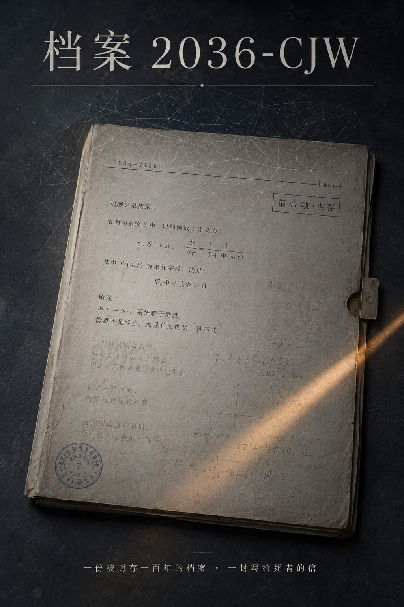

::: {.novels-page}

::: {.novel-detail-hero}
::: {.novel-detail-hero-inner}
::: {.novel-detail-cover}
{.cover-img}
:::
::: {.novel-detail-header}
[中篇小说 &middot; 九幕]{.novels-label-en}

# 档案 2036-CJW {.novel-detail-title}

[一份被封存一百年的档案 &middot; 一封写给死者的信]{.novel-detail-subtitle}

::: {.novel-detail-synopsis}
档案中心夜里没有真正的安静。二一三六年的某个清晨，系统把档案 2036-CJW 推到她面前——一份被引用三万七千次的官方讣告，一位三十三岁去世的女学者，一项已封存了一百年的第 47 项。她本可以一瞬读完那份讣告，但她在"享年三十三岁"这一行上停留了零点三秒。

她翻开一份用自编 LaTeX 模板写下的论文手稿，封面致谢只有四个字：献给母亲。她翻到一封距死亡七十一小时的未发出邮件草稿，停在第七行；她进入档案的低优先级层，把讣告、退休专访、未回复的私信、追思会发言、纪念位致辞并置在副面板里，不加标题；她在二楼楼梯口对面那一段稀疏点云前重建了凌晨零点四十一分发生的事，把最可能的版本与最致命的版本并置。

她在六月十九日提交最终稿。状态码 C-2136。然后做了一件不在任何规范里的事——给陈见微写一封信，把它存在元数据层最深的一格里，再上一道只有她自己能解的锁。
:::

[&larr; 返回小说列表](/novels.html){.novel-back-link}

:::
:::
:::

::: {.novels-content}

::: {.novel-toc-section}

::: {.novel-progress-note}
全篇九幕已上线，可按幕序进入阅读。
:::

::: {.novel-chapter-list}

::: {.novel-chapter .chapter-available data-href="chapter-01-disishiqixiang/" role="link" tabindex="0" onclick="window.location.href=this.dataset.href" onkeydown="if(event.key==='Enter'||event.key===' '){event.preventDefault();window.location.href=this.dataset.href;}"}
::: {.chapter-number}
一
:::
::: {.chapter-entry}
::: {.chapter-title}
[第一幕：第47项](chapter-01-disishiqixiang/)
:::
::: {.chapter-teaser}
她在"享年三十三岁"这一行上停留了零点三秒；档案 2036-CJW 第 47 项仍封存，自动解封触发器指向 2136 年。
:::
:::
:::

::: {.novel-chapter .chapter-available data-href="chapter-02-wenhexingjiashe/" role="link" tabindex="0" onclick="window.location.href=this.dataset.href" onkeydown="if(event.key==='Enter'||event.key===' '){event.preventDefault();window.location.href=this.dataset.href;}"}
::: {.chapter-number}
二
:::
::: {.chapter-entry}
::: {.chapter-title}
[第二幕：温和性假设](chapter-02-wenhexingjiashe/)
:::
::: {.chapter-teaser}
辅助引理 3.2 那一条 Lipschitz 假设，在另外十二篇同年同审稿池的稿子里都被温和处理；只有给陈见微的那一份用了"重大方法论缺陷"。
:::
:::
:::

::: {.novel-chapter .chapter-available data-href="chapter-03-taohuawen/" role="link" tabindex="0" onclick="window.location.href=this.dataset.href" onkeydown="if(event.key==='Enter'||event.key===' '){event.preventDefault();window.location.href=this.dataset.href;}"}
::: {.chapter-number}
三
:::
::: {.chapter-entry}
::: {.chapter-title}
[第三幕：桃花纹](chapter-03-taohuawen/)
:::
::: {.chapter-teaser}
伦理监护沈砚开了同步频道——一个头像签着浅色桃花纹的人，与她共享一段不属于工作纪律的沉默。
:::
:::
:::

::: {.novel-chapter .chapter-available data-href="chapter-04-diqihang/" role="link" tabindex="0" onclick="window.location.href=this.dataset.href" onkeydown="if(event.key==='Enter'||event.key===' '){event.preventDefault();window.location.href=this.dataset.href;}"}
::: {.chapter-number}
四
:::
::: {.chapter-entry}
::: {.chapter-title}
[第四幕：第七行](chapter-04-diqihang/)
:::
::: {.chapter-teaser}
陈见微未发出的草稿邮件十二行，她在第七行停了四分钟。标签名是她自己写的——"轴"。
:::
:::
:::

::: {.novel-chapter .chapter-available data-href="chapter-05-diyouxianji/" role="link" tabindex="0" onclick="window.location.href=this.dataset.href" onkeydown="if(event.key==='Enter'||event.key===' '){event.preventDefault();window.location.href=this.dataset.href;}"}
::: {.chapter-number}
五
:::
::: {.chapter-entry}
::: {.chapter-title}
[第五幕：低优先级](chapter-05-diyouxianji/)
:::
::: {.chapter-teaser}
讣告、退休专访、未回复的私信、追思会发言、纪念位致辞——她把它们摆在副面板里，不加标题，让它们自己说话。
:::
:::
:::

::: {.novel-chapter .chapter-available data-href="chapter-06-loutikou/" role="link" tabindex="0" onclick="window.location.href=this.dataset.href" onkeydown="if(event.key==='Enter'||event.key===' '){event.preventDefault();window.location.href=this.dataset.href;}"}
::: {.chapter-number}
六
:::
::: {.chapter-entry}
::: {.chapter-title}
[第六幕：楼梯口](chapter-06-loutikou/)
:::
::: {.chapter-teaser}
三十一帧稀疏点云、十七分钟空白门禁、退休告别演讲里唯一一次省略号；重建给出三种可能，最致命的那一版置信度只有 0.11。
:::
:::
:::

::: {.novel-chapter .chapter-available data-href="chapter-07-weiwanxin/" role="link" tabindex="0" onclick="window.location.href=this.dataset.href" onkeydown="if(event.key==='Enter'||event.key===' '){event.preventDefault();window.location.href=this.dataset.href;}"}
::: {.chapter-number}
七
:::
::: {.chapter-entry}
::: {.chapter-title}
[第七幕：委婉信](chapter-07-weiwanxin/)
:::
::: {.chapter-teaser}
重审委员会送来一份"非正式建议、不入卷"的预审件。三条建议按从强到弱排列；她接受两条，拒绝一条。
:::
:::
:::

::: {.novel-chapter .chapter-available data-href="chapter-08-geima/" role="link" tabindex="0" onclick="window.location.href=this.dataset.href" onkeydown="if(event.key==='Enter'||event.key===' '){event.preventDefault();window.location.href=this.dataset.href;}"}
::: {.chapter-number}
八
:::
::: {.chapter-entry}
::: {.chapter-title}
[第八幕：给妈](chapter-08-geima/)
:::
::: {.chapter-teaser}
私人草稿里最晚的一份未发出文件主题栏写着——给妈。她做了一件不在任何规范里的决定：不在公开报告里提到这封信的存在。
:::
:::
:::

::: {.novel-chapter .chapter-available data-href="chapter-09-zhuhe/" role="link" tabindex="0" onclick="window.location.href=this.dataset.href" onkeydown="if(event.key==='Enter'||event.key===' '){event.preventDefault();window.location.href=this.dataset.href;}"}
::: {.chapter-number}
九
:::
::: {.chapter-entry}
::: {.chapter-title}
[第九幕：祝贺](chapter-09-zhuhe/)
:::
::: {.chapter-teaser}
状态码 C-2136。她在元数据层最深的一格里写下一封给陈见微的信，再上一道只有她自己能解的锁；档案 2036-CJW 第 47 项仍封存。
:::
:::
:::

:::

:::

:::

::: {.novels-footer}
::: {.novels-footer-inner}
"静默不是终止，而是信息的另一种形式。"
:::
:::

:::
