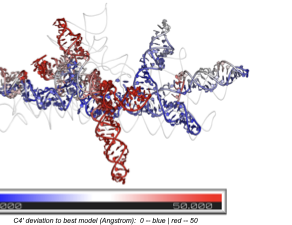

### Quartic Detection Theory: The Geometry of Hidden Variables

A series of papers establishing exact detectability theory for hidden degrees of freedom on statistical manifolds. [Read the full theory note →](notes/2026-04-quartic-detection-theory/)

We prove that hidden variables are **orders of magnitude harder to detect** than classical statistics predicts. When a hidden force couples linearly to the dynamics but quadratically to the observables — the generic case for power spectra, covariances, and correlations — the data requirement scales as $\lambda^{-4}$, not $\lambda^{-2}$. For a 10% coupling, this quartic penalty demands ~1000× more data than the naive Fisher-information expectation.

**Core results**:

- **Quartic detection law**: $D_\mathrm{KL}^\mathrm{min}(\lambda) = C\lambda^4 + O(\lambda^6)$ on general statistical manifolds, with exact system-specific coefficients
- **Pairing principle**: A single probe is provably blind to hidden common input; detection requires $\geq 2$ channels, with power growing as sensor pairs $\binom{n}{2}$
- **Spectral dark regime**: At timescale coalescence the quartic coefficient vanishes — hidden forcing becomes spectrally invisible
- **Cross-spectral escape**: Off-diagonal spectral structure breaks the single-channel impossibility, remaining strictly positive at coalescence
- **Thermodynamic bridge**: Cross-spectral detectability certifies positive entropy production, linking observable structure to the arrow of time

**Mathematical toolkit**: Information geometry (Amari), Kullback-Leibler projection, semiparametric efficiency (BKRW), Whittle likelihood, Mori-Zwanzig coarse-graining, stochastic thermodynamics (Seifert), spectral analysis on statistical manifolds.

**Papers in this series**:

- *Why Single Probes Cannot Detect Hidden Forcing: A Quartic Detection Law* — under review, PRL
- *Cross Spectra Break the Single-Channel Impossibility* — under review, PRL
- *Timescale Coalescence Makes Hidden Persistent Forcing Spectrally Dark* — under review, PRE ([arXiv:2603.20917](https://arxiv.org/abs/2603.20917))
- *Conditioning on a Volatility Proxy Compresses the Apparent Timescale of Collective Market Correlation* — under review, PRE ([arXiv:2603.14072](https://arxiv.org/abs/2603.14072))

---

### SpecRNA-QA: Spectral Graph Methods for RNA 3D Quality Assessment

A lightweight, reference-free tool for assessing RNA 3D structure quality using spectral graph features. [GitHub](https://github.com/yudabitrends/specrnaq) · [Read the method note →](notes/2026-04-specrnaq/)

{fig-align="center" width="80%"}

Existing RNA quality assessment methods evaluate local atomic contacts — they fail when local structure is correct but entire domains are misplaced. **SpecRNA-QA** solves this by extracting multi-scale spectral features from the graph Laplacian of RNA contact networks, capturing global topology that local metrics miss.

**Performance**:

- **CASP16 benchmark** (42 targets, 7,368 models): median Spearman $\rho = 0.689$ in supervised mode, outperforming geometry-based baselines ($\rho = 0.465$) with $p = 1.2 \times 10^{-10}$
- **Large RNAs** (>200 nt): performance advantage reaches $+0.233$ in correlation over geometry baselines — the regime where global topology matters most
- **Fast**: 15 ms for 100-nt structures, ~4.2 s for 800-nt molecules. CPU-only, no GPU required

**How it works**: Contact graphs at multiple distance thresholds → ~312 spectral features from normalized Laplacian (eigenvalue statistics, heat-kernel traces, participation ratios) → XGBRanker model for quality prediction. The most discriminative features are heat-kernel traces measuring multi-scale diffusion, connecting RNA quality to the *transport geometry* of the contact network.

**Papers**:

- *Spectral Graph Features Capture Global Topology for Reference-free RNA 3D Structure Quality Assessment* — under review, Briefings in Bioinformatics
- *Spectral Coherence Index: A Model-Free Metric for Protein Structural Ensemble Quality Assessment* — under review, IEEE JBHI ([arXiv:2603.25880](https://arxiv.org/abs/2603.25880))

---

### MultiViT / MultiViT2

Multimodal vision transformer frameworks for brain imaging analysis (2022–2024).

- Integrates structural MRI and functional connectivity data
- Achieves AUC 0.833 for schizophrenia classification (MultiViT)
- Data augmentation via latent diffusion models (MultiViT2)
- Published in *NeuroImage*, *Human Brain Mapping*, and *IEEE ISBI*
